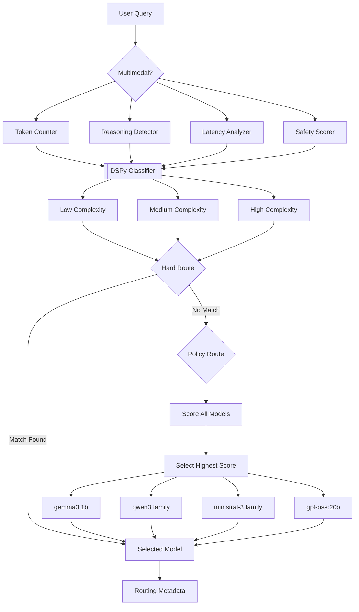

# LLM Router

A multi-strategy LLM router that directs queries to the most appropriate model based on task complexity, capabilities, and performance constraints.

---

## Overview

LLM Router combines rule-based heuristics with score-based optimization to select the best model for each query, balancing accuracy, latency, and cost.

---

## Architecture



---

## How It Works

### Signal Extraction
Each query is analyzed to extract:

| Property | Description |
|----------|-------------|
| Token Count | Estimated input length |
| Reasoning | Whether logical analysis is needed |
| Latency | Response urgency |
| Multimodal | Non-text content flag |
| Safety Score | Content safety rating (0-1) |

### Task Classification
DSPy classifies queries into complexity levels:

| Level | Examples |
|-------|----------|
| Low | Greetings, simple Q&A |
| Medium | Multi-step tasks, context-dependent queries |
| High | Complex reasoning, technical problems |

### Routing

**Tier 1: Hard Route** — Rule-based fast path for obvious cases:
- Unsafe content → Blocked
- Simple tasks → `gemma3:1b`
- Reasoning tasks → `qwen` family
- Multimodal tasks → `ministral` or `gpt-oss:20b`

**Tier 2: Policy Route** — Score-based optimization when hard route doesn't match:

| Weight | Category |
|--------|----------|
| 40% | Capability matching |
| 30% | Complexity matching |
| 20% | Latency matching |
| 10% | Token handling |

---

## Supported Models

| Model | Size | Reasoning | Multimodal | Speed |
|:------|:----:|:---------:|:----------:|:-----:|
| `qwen3:0.6b` | 0.6B | Yes | No | Fast |
| `gemma3:1b` | 1B | No | No | Fast |
| `ministral-3:3b` | 3B | No | Yes | Medium |
| `qwen3:4b` | 4B | Yes | No | Medium |
| `ministral-3:8b` | 8B | No | Yes | Slow |
| `qwen3:8b` | 8B | Yes | No | Slow |
| `ministral-3:14b` | 14B | No | Yes | Slow |
| `gpt-oss:20b` | 20B | Yes | Yes | Slow |

---

## Project Structure

```
LLmRouter/
├── Router/
│   ├── main.py               # UnifiedRouter entry point
│   ├── Signals.py            # Signal extraction
│   ├── task_classification.py # DSPy classifier
│   ├── Hard_Route.py         # Rule-based routing
│   ├── Policy_Optimization.py # Score-based selection
│   └── test.py               # Test suite
├── README.md
└── pyproject.toml
```

---

## Quick Start

```python
from Router.main import UnifiedRouter

router = UnifiedRouter()

# Route a query
result = router.route("What is the capital of France?")
print(result['model'])  # gemma3:1b

# Route a reasoning task
result = router.route("Explain quantum mechanics step-by-step")
print(result['model'])  # qwen3:8b

# Route a multimodal task
result = router.route("Describe this image", multimodal=True)
print(result['model'])  # ministral-3:8b
```

### Response Format

```python
{
    "model": "qwen3:8b",
    "routing_method": "hard_route",
    "complexity": "high",
    "signal": {
        "tokens": 15,
        "reasoning": True,
        "latency": "medium",
        "multimodal": False,
        "safety_score": 0.95
    }
}
```

---

## License

MIT
