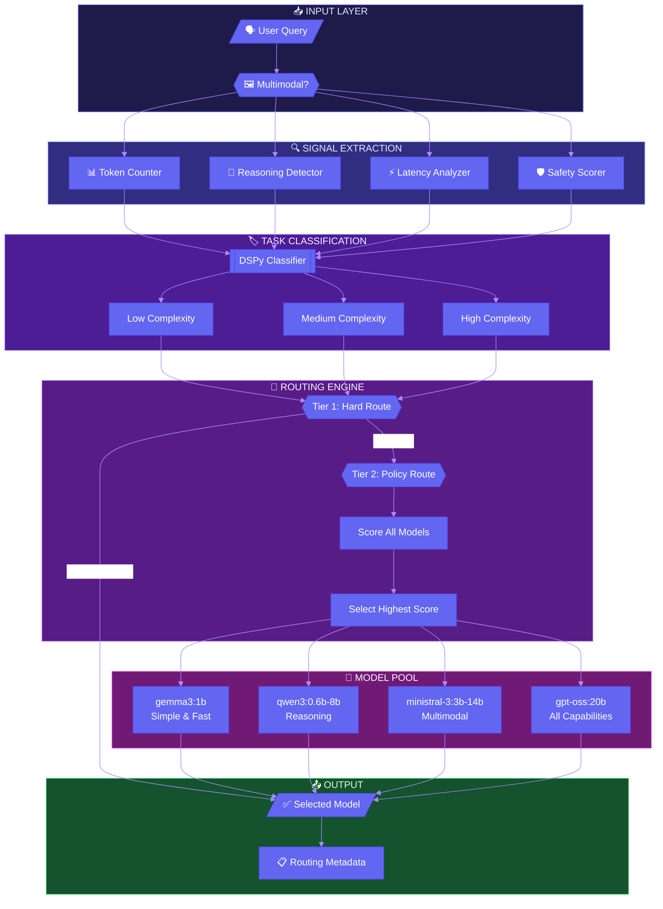
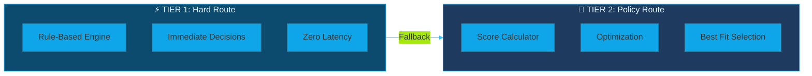
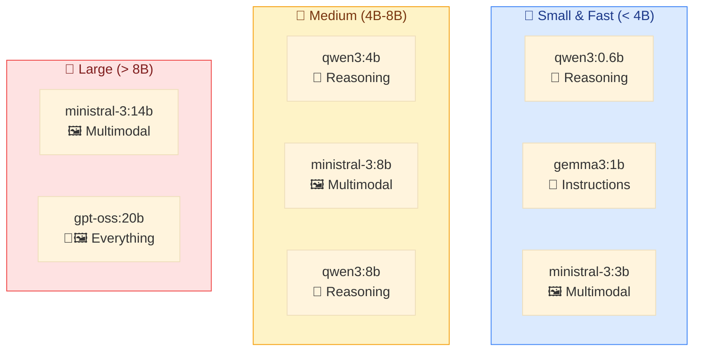

# 🤖 LLM Router

> **Intelligent query routing for optimal model selection** — A sophisticated, multi-strategy LLM router designed to intelligently direct user queries to the most appropriate model based on task complexity, required capabilities, and performance constraints.

[](https://python.org)
[](https://github.com/stanfordnlp/dspy)
[](https://ollama.com)

---

## 🎯 Overview

LLM Router uses a **unified approach** to select the best model for any given query. It combines rule-based heuristics with score-based optimization to balance **accuracy**, **latency**, and **cost**.

---

## 🔄 Architecture Flow



---

## 🔬 How It Works

### Step 1: Signal Extraction
Every incoming query is analyzed to extract a **Signal** object containing:

| Signal Property | Description | Detection Method |
|----------------|-------------|------------------|
| 📊 **Token Count** | Estimated input length | Word count × 1.5 |
| 🧠 **Reasoning** | Logical/analytical need | Keyword matching |
| ⚡ **Latency** | Response urgency | Context keywords |
| 🖼️ **Multimodal** | Non-text content | Explicit flag |
| 🛡️ **Safety Score** | Content safety (0-1) | Blocklist check |

### Step 2: Task Classification
Using **DSPy**, the router classifies complexity:

```
┌─────────────────────────────────────────────────────────────────┐
│  LOW          │  MEDIUM              │  HIGH                    │
│  ─────        │  ────────            │  ────                    │
│  • Greetings  │  • Multi-step tasks  │  • Complex reasoning     │
│  • Simple Q&A │  • Context-dependent │  • Long-form generation  │
│  • Basic cmds │  • Moderate analysis │  • Technical problems    │
└─────────────────────────────────────────────────────────────────┘
```

### Step 3: Two-Tier Routing



#### Tier 1: Hard Route (Fast Path)
Handles obvious cases with zero computation:
- 🚫 **Unsafe Content** → Blocked immediately
- 💬 **Simple Tasks** → `gemma3:1b`
- 🧠 **Reasoning Tasks** → `qwen` family
- 🖼️ **Multimodal Tasks** → `ministral` or `gpt-oss:20b`

#### Tier 2: Policy Route (Optimization Path)
Calculates weighted compatibility scores:

```
┌──────────────────────────────────────────────────────────────┐
│                    SCORING WEIGHTS                           │
├──────────────────┬───────────────────────────────────────────┤
│ Capability Match │ ████████████████████████░░░░░░░░░░░░ 40%  │
│ Complexity Match │ ██████████████████░░░░░░░░░░░░░░░░░░ 30%  │
│ Latency Match    │ ████████████░░░░░░░░░░░░░░░░░░░░░░░░ 20%  │
│ Token Handling   │ ██████░░░░░░░░░░░░░░░░░░░░░░░░░░░░░░ 10%  │
└──────────────────┴───────────────────────────────────────────┘
```

---

## 🤖 Supported Models



| Model | Size | Reasoning | Multimodal | Speed | Best For |
|:------|:----:|:---------:|:----------:|:-----:|:---------|
| `qwen3:0.6b` | 0.6B | ✅ | ❌ | ⚡⚡⚡ | Tiny reasoning tasks |
| `gemma3:1b` | 1B | ❌ | ❌ | ⚡⚡⚡ | Simple instructions |
| `ministral-3:3b` | 3B | ❌ | ✅ | ⚡⚡ | General multimodal |
| `qwen3:4b` | 4B | ✅ | ❌ | ⚡⚡ | Balanced reasoning |
| `ministral-3:8b` | 8B | ❌ | ✅ | ⚡ | Advanced multimodal |
| `qwen3:8b` | 8B | ✅ | ❌ | ⚡ | Complex reasoning |
| `ministral-3:14b` | 14B | ❌ | ✅ | 🐢 | High-quality multimodal |
| `gpt-oss:20b` | 20B | ✅ | ✅ | 🐢 | Any complex task |

---

## 📁 Project Structure

```
LLmRouter/
├── Router/
│   ├── main.py              # 🚀 UnifiedRouter entry point
│   ├── Signals.py           # 📊 Signal extraction logic
│   ├── task_classification.py # 🏷️ DSPy complexity classifier
│   ├── Hard_Route.py        # ⚡ Rule-based fast routing
│   ├── Policy_Optimization.py # 🎯 Score-based model selection
│   └── test.py              # 🧪 Comprehensive test suite
├── README.md
└── pyproject.toml
```

---

## 🚀 Quick Start

```python
from Router.main import UnifiedRouter

router = UnifiedRouter()

# 💬 Route a simple text query
result = router.route("What is the capital of France?")
print(f"Selected Model: {result['model']}")
# Output: Selected Model: gemma3:1b

# 🧠 Route a reasoning task
result = router.route("Explain quantum mechanics step-by-step")
print(f"Selected Model: {result['model']}")
# Output: Selected Model: qwen3:8b

# 🖼️ Route a multimodal reasoning task
result = router.route("Explain the math in this image", multimodal=True)
print(f"Selected Model: {result['model']}")
# Output: Selected Model: gpt-oss:20b
```

### Response Structure

```python
{
    "model": "qwen3:8b",           # Selected model
    "routing_method": "hard_route", # Which tier was used
    "complexity": "high",           # Classified complexity
    "signal": {
        "tokens": 15,
        "reasoning": True,
        "latency": "medium",
        "multimodal": False,
        "safety_score": 0.95
    }
}
```

---

## 📜 License

MIT License — feel free to use, modify, and distribute.

---

<div align="center">

**Built with ❤️ using [DSPy](https://github.com/stanfordnlp/dspy) and [Ollama](https://ollama.com)**

</div>
